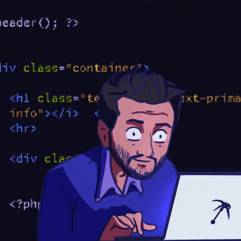

# :robot: Olá, Seja bem vindo meu perfil, 
 
 :space_invader: Bom ter você por aqui!
 
  
  

  
  
  

  
  # Sou estudante do curso Ciencias da computação !
  

- Replit :
<a href="https://replit.com/@FelipeQuirino2">Replit</a>

- Linkedin :
<a href="https://www.linkedin.com/in/felipe-quirino-527b91233/">Linkedin</a>

   
   
  
  

